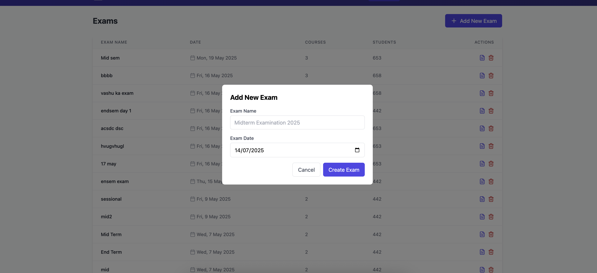

# Exam Seat Planner

<div align="center">
  
  <p><em>Modern dashboard for comprehensive exam seating management</em></p>
</div>

A comprehensive MERN stack application for managing exam seating arrangements in educational institutions with intelligent seat allocation algorithms.

## 🚀 Features

- **Exam Management**: Create and manage exams with multiple courses
- **Course Data Import**: Import student data from Excel files with roll number validation
- **Classroom Management**: Configure classrooms with custom layouts and capacities
- **Intelligent Seating**: Automated seating plan generation with optimized algorithms
- **Export Functionality**: Export seating plans to Excel with detailed layouts
- **Real-time Updates**: Dynamic updates with toast notifications
- **Seat Swapping**: Manual adjustments with drag-and-drop functionality
- **Visual Analytics**: Statistics and utilization charts

## 🛠 Tech Stack

- **Frontend**: React, TypeScript, Tailwind CSS, Vite
- **Backend**: Node.js, Express.js
- **Database**: MongoDB with Mongoose
- **File Handling**: Multer for uploads, XLSX for Excel processing
- **UI Components**: Lucide React icons, React Dropzone
- **Notifications**: React Toastify

## 📋 Prerequisites

- Node.js (v14 or higher)
- MongoDB
- npm or yarn

## ⚙️ Installation

1. **Clone the repository:**
```bash
git clone https://github.com/YOUR_USERNAME/seat-planner.git
cd seat-planner
```

2. **Install dependencies:**
```bash
npm install
```

3. **Create environment file:**
```bash
cp .env.example .env
```

4. **Configure your environment variables in `.env`:**
```env
MONGODB_URI=mongodb://localhost:27017/seat-planner
PORT=5001
```

5. **Start the development servers:**
```bash
npm run dev:full
```

This will start both the React frontend (port 5173) and Express backend (port 5001).

## 📖 Application Walkthrough

### 1. Dashboard Overview
<div align="center">
  
  <p><em>Main dashboard showing system overview and navigation</em></p>
</div>

The dashboard provides a centralized view of all exam management features with easy navigation to different modules.

### 2. Exam Management Interface
<div align="center">
  
  <p><em>Exam creation and management interface</em></p>
</div>

Create and manage multiple exams with detailed course information and scheduling.

### 3. Course Data Import
<div align="center">
  
  <p><em>Excel file upload and course data mapping</em></p>
</div>

Import student data from Excel files with automatic validation and course assignment.

### 4. Classroom Configuration
<div align="center">
  
  <p><em>Classroom layout configuration and capacity management</em></p>
</div>

Configure classroom layouts, set capacities, and manage seating arrangements.

### 5. Seating Plan Generation
<div align="center">
  
  <p><em>Automated seating plan generation with algorithm selection</em></p>
</div>

Generate optimized seating plans using intelligent algorithms that prevent cheating.

### 6. Interactive Seating View
<div align="center">
  
  <p><em>Visual representation of seating arrangements with course color coding</em></p>
</div>

Interactive seating charts with color-coded course assignments and seat management.

### 7. Detailed Seat Allocation
<div align="center">
  
  <p><em>Detailed view of individual seat assignments and student information</em></p>
</div>

Comprehensive seat-by-seat view with student details and course information.

### 8. Algorithm Analytics
<div align="center">
  
  <p><em>Real-time analytics showing algorithm performance and distribution</em></p>
</div>

Analytics dashboard showing seating distribution efficiency and algorithm performance.

### 9. Export and Reporting
<div align="center">
  
  <p><em>Export seating plans to Excel with customizable formats</em></p>
</div>

Export functionality with multiple format options and customizable layouts.

### 10. System Statistics
<div align="center">
  
  <p><em>Comprehensive statistics and utilization reports</em></p>
</div>

Detailed statistics showing classroom utilization, course distribution, and system performance.

### 11. Advanced Features
<div align="center">
  
  <p><em>Advanced configuration and management features</em></p>
</div>

Advanced features for fine-tuning seating arrangements and system configuration.

## 🧠 Intelligent Seating Algorithm

### Algorithm Overview
The application employs a sophisticated **Column-wise Course Distribution Algorithm** that ensures optimal seating arrangements to prevent academic misconduct while maximizing classroom utilization.

### Core Algorithm Flow


### Algorithm Features

#### 1. Anti-Cheating Strategy
- **Course Separation**: Students from the same course are never seated adjacent to each other
- **Column-wise Distribution**: Alternating course assignment across columns
- **Random Shuffling**: Within-course student randomization

#### 2. Optimization Techniques
```javascript
// Course pairing optimization
function optimizeCourseDistribution(courses) {
  // Sort by student count (descending)
  const sortedCourses = courses.sort((a, b) => b.students.length - a.students.length);
  
  // Create balanced pairs to minimize empty seats
  return createOptimalPairs(sortedCourses);
}
```

#### 3. Seat Assignment Pattern


### Example Seating Pattern

```
Classroom Layout (Sample 6x4):
┌─────┬─────┬─────┬─────┐
│ CS1 │ ME1 │ CS2 │ ME2 │
│ CS3 │ ME3 │ CS4 │ ME4 │
│ CS5 │ ME5 │ CS6 │ ME6 │
│ CS7 │ ME7 │ CS8 │ ME8 │
│ CS9 │ ME9 │ CS10│ ME10│
│ CS11│ ME11│ CS12│ ME12│
└─────┴─────┴─────┴─────┘

Legend: 
CS = Computer Science Engineering
ME = Mechanical Engineering
```

## 🔧 API Documentation

### Exam Management
- `GET /api/exams` - Retrieve all exams
- `POST /api/exams` - Create new exam
- `PUT /api/exams/:id` - Update exam details
- `DELETE /api/exams/:id` - Delete exam
- `POST /api/exams/:id/import` - Import course data

### Classroom Management
- `GET /api/classrooms` - Get all classrooms
- `POST /api/classrooms` - Create new classroom
- `PUT /api/classrooms/:id` - Update classroom
- `POST /api/classrooms/bulk-create-default` - Create default classrooms

### Seating Plans
- `GET /api/seating-plans` - Get all seating plans
- `POST /api/seating-plans/generate` - Generate new seating plan
- `GET /api/seating-plans/:id` - Get specific seating plan
- `GET /api/seating-plans/:id/export` - Export to Excel
- `PUT /api/seating-plans/:id/swap` - Swap student seats

## 📁 Project Structure

```
seat-planner/
├── src/                    # Frontend React application
│   ├── components/         # Reusable UI components
│   │   ├── Layout/        # Layout components
│   │   ├── Forms/         # Form components
│   │   └── Charts/        # Chart components
│   ├── pages/             # Main application pages
│   │   ├── Dashboard/     # Dashboard page
│   │   ├── Exams/         # Exam management
│   │   ├── Classrooms/    # Classroom management
│   │   └── SeatingPlans/  # Seating plan pages
│   ├── utils/             # Utility functions
│   └── types/             # TypeScript type definitions
├── server/                # Backend Express application
│   ├── models/            # MongoDB schemas
│   ├── routes/            # API endpoints
│   ├── middleware/        # Express middleware
│   ├── utils/             # Server utilities
│   └── uploads/           # File uploads directory
├── screenshots/           # Application screenshots
└── docs/                 # Additional documentation
```

## 📄 Data Format Requirements

### Excel File Format for Student Import
| Column | Required | Format | Example |
|--------|----------|--------|---------|
| Roll No. | Yes | BT{YY}{BRANCH}{XXX} | BT21CSE001 |
| Name | Yes | Full Name | John Doe |

### Classroom Configuration
- **Rows**: 1-20 (configurable)
- **Columns**: 1-10 (configurable)
- **Capacity**: Calculated automatically
- **Unavailable Seats**: Mark specific seats as unavailable

## 🎯 Key Benefits

1. **Efficiency**: Automated seating reduces manual effort by 90%
2. **Integrity**: Anti-cheating algorithm ensures exam security
3. **Flexibility**: Supports multiple exam formats and classroom layouts
4. **Scalability**: Handles large-scale examinations with thousands of students
5. **Analytics**: Provides insights into space utilization and efficiency

## 🤝 Contributing

1. Fork the repository
2. Create a feature branch: `git checkout -b feature-amazing-feature`
3. Commit your changes: `git commit -m 'Add amazing feature'`
4. Push to the branch: `git push origin feature-amazing-feature`
5. Open a Pull Request


---

